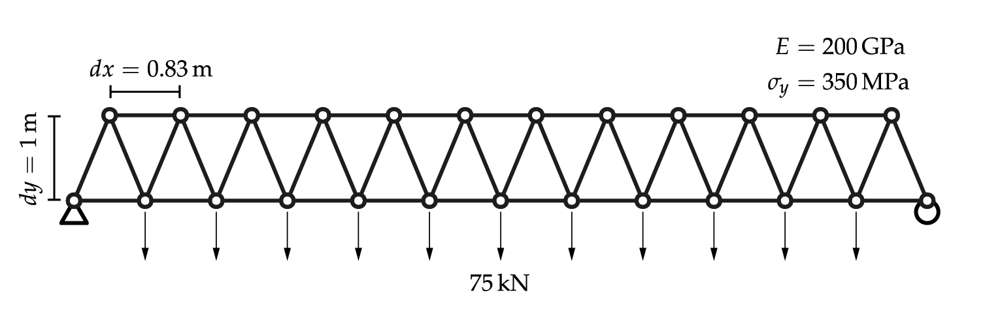
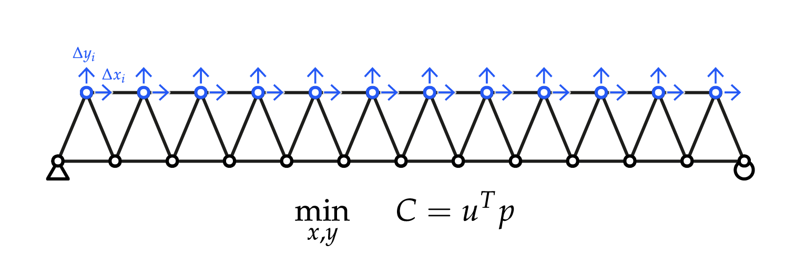
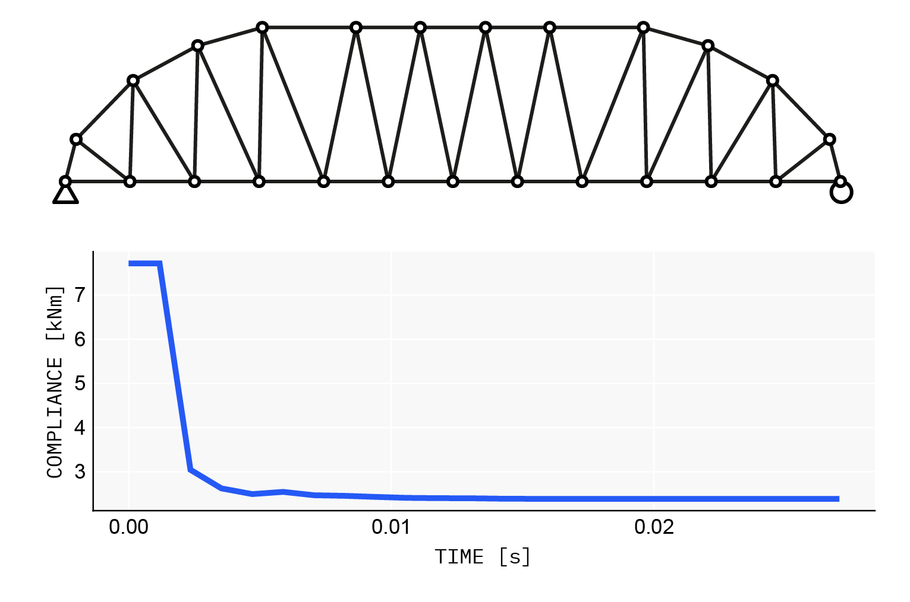
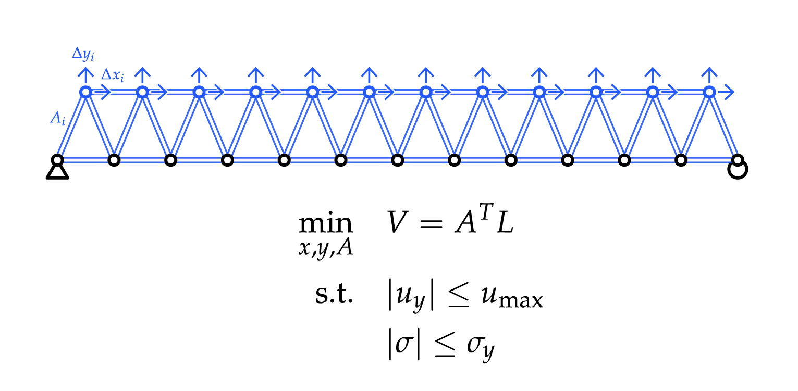
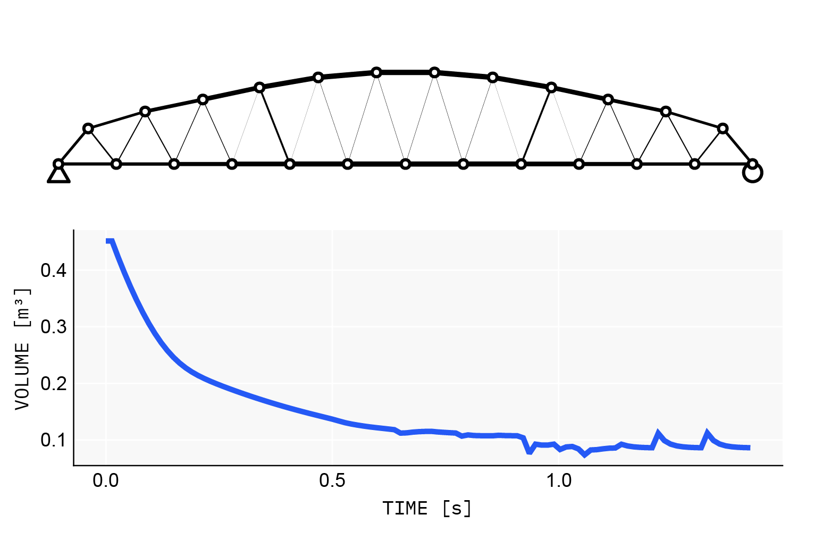

# AsapOptim.jl


High performance *general* structural optimization in the [Asap.jl](https://github.com/keithjlee/Asap) environment.

# Installation
In package mode, add `AsapOptim` via:
```julia-repl
pkg> add AsapOptim
```

# Usage
The files used to make these examples are in `examples/`

Let's consider the following truss structure:


We can make and analyze this using `Asap.jl` via:

```julia
using Asap
# initial section
A = 0.01 # [m²]
E = 200E6 # [KN/m²]
fy = 350e3 # [kN/m²]
section = TrussSection(A, E)

L = 10. # total span of truss [m]
nx = 12 # number of bays in span
dy = 1.0 # truss depth [m]
load = 75. # downward force applied at free bottom chord nodes [kN]

# Generate truss
dx = L / nx # bay length [m]
dmax = L / 360 #displacement limit [m]

# bottom nodes
bottom_nodes = [TrussNode([x, 0., 0.], :free, :bottom) for x in range(0, L, nx+1)]

# make supports
fixnode!(first(bottom_nodes), :pinned)
first(bottom_nodes).id = :pin

fixnode!(last(bottom_nodes), :xfree)
last(bottom_nodes).id = :roller

# top nodes
top_nodes = [TrussNode([dx/2 + dx * (i-1), dy, 0.], :free, :top) for i = 1:nx]

# bottom chord elements
bottom_elements = [TrussElement(bottom_nodes[i], bottom_nodes[i+1], section, :bottom) for i = 1:nx]

#top chord elements
top_elements = [TrussElement(top_nodes[i], top_nodes[i+1], section, :top) for i = 1:nx-1]

# web elements
web_elements = [
    [TrussElement(nb, nt, section, :web) for (nb, nt) in zip(bottom_nodes[1:end-1], top_nodes)];
    [TrussElement(nt, nb, section, :web) for (nt, nb) in zip(top_nodes, bottom_nodes[2:end])]
]

# collect
nodes = [bottom_nodes; top_nodes]
elements = [bottom_elements; top_elements; web_elements]
loads = [NodeForce(node, [0, -load, 0]) for node in nodes[:bottom]]

# assemble
model = TrussModel(nodes, elements, loads)
planarize!(model)
solve!(model)
```

## Unconstrained optimization
Let's find the minimum compliance geometry of our truss (minimum strain energy).


### Design variables
Our design variables are `SpatialVariable`s for each top node: one in the x-axis and one in the y-axis. Defined via:
```julia
# bounds
xmin, xmax = (-1, 1) .* dx ./ 2 .* .9
ymin, ymax = -.9dy, dy

vars = [
    [SpatialVariable(node, 0., xmin, xmax, :X) for node in model.nodes[:top]];
    [SpatialVariable(node, 0., ymin, ymax, :Y) for node in model.nodes[:top]]
]
```

- `SpatialVariables` for a Cartesian axis can be defined by: `SpatialVariable(node, initial_value, lowerbound, upperbound, :AXIS)`, where `:AXIS` can be `:X, :Y, :Z`.
- You can specify the directional vector of a `SpatialVariable` via: `SpatialVariable(node, vector, initial_value, lowerbound, upperbound)`, where `vector` is a 3d vector that specifies the "rail" that the variable can travel on.
- `SpatialVariables` are *additive*. I.e., they do not specify the absolute position of a node, but rather an *offset* from the initial position.

### Parameters
We then generate a `TrussOptParams` object that contains all necessary information to perform analysis using our variables (such as node-element topology, fixed values, etc).

```julia
params = TrussOptParams(model, vars)
x0 = copy(params.values) #this is the starting point for optimization
```

### Objective function
Define your objective function as a typical Julia function. Generally, the arguments should include `x`, which is the vector of design variables, equal in size to `params.values`, as well as a `p::TrussOptParams` object that enables the use of convenient solver functions. Like so:

```julia
function obj(x, p)
    res = solve_truss(x, p)

    dot(res.U, p.P)
end
```

`solve_truss(x::Vector{Float64}, p::TrussOptParams)` updates the structure with the given values in `x`, and returns a `TrussResults` object:

```julia
struct TrussResults
    X::Vector{Float64} #X position of nodes
    Y::Vector{Float64} #Y position of nodes
    Z::Vector{Float64} #Z position of nodes
    A::Vector{Float64} #Areas of all elements
    L::Vector{Float64} #Lengths of all elements
    K::Vector{Matrix{Float64}} #elemental stiffness matrices in global coordinate system
    R::Vector{Matrix{Float64}} #elemental transformation matrices
    U::Vector{Float64} #global displacement vector
end
```
which contains up-to-date values of all relevant fields that might be useful in defining your objective function.

In this case, structural compliance is simply the dot product between the displacement vector `res.U` and the static vector of external loads, which is stored in our params as `p.P`.


Let's make a function closure for our 2-argument objective function to work well with our optimization package of choice, `Nonconvex.jl`:

```julia
OBJ = x -> obj(x, params)
```

### Optimization using `Nonconvex.jl` and `NonconvexNLopt.jl`
Let's solve our optimization problem!
```julia
using Nonconvex, NonconvexNLopt

# make optimization model
optmodel = Nonconvex.Model(OBJ)

# add variable bounds
addvar!(optmodel, params.lb, params.ub)

# define algorithm and options
alg = NLoptAlg(:LD_LBFGS)
opts = NLoptOptions(
    maxeval = 500,
    maxtime = 60
)

# solve
res = optimize(
    optmodel,
    alg,
    x0,
    options = opts
)
```

We can create a new `Asap.TrussModel` from our results using the `updatemodel` function:
```julia
# make new model from solution
model2 = updatemodel(params, res.minimizer)
```
giving:


## Constrained optimization
Let's try a different problem:

Along with our spatial design variables, we also consider the cross-section areas of our elements to find a minimum volume truss that meets our stress and displacement constraints.
Without the constraints, the solutions is trivial: make the truss as shallow as possible, and set the areas to 0.

With our constraints, the problem is more interesting: reducing the depth of the truss reduces element lengths and thus our volume, at the cost of increasing internal force values that increase the required cross-section area. What's the best tradeoff here?

### Design variables
Simply add out area variables:
```julia
vars = TrussVariable[
    [SpatialVariable(node, 0., xmin, xmax, :X) for node in model.nodes[:top]];
    [SpatialVariable(node, 0., ymin, ymax, :Y) for node in model.nodes[:top]];
    [AreaVariable(element, element.section.A, .01element.section.A, 5element.section.A) for element in model.elements]
]
```
We've restricted the element area to between 1% and 500% of the starting area.

### Parameters
Define our optimization parameters as before

```julia
params = TrussOptParams(model, vars)
x0 = copy(params.values) #this is the starting point for optimization
```

### Objective and Constraint functions
```julia
# objective function
function obj(x, p)
    geo = GeometricProperties(x, p)

    dot(geo.L, geo.A)
end

#make closure
OBJ = x -> obj(x, params)

# constraint function
function cstr(x, p, dmax, smax)
    res = solve_truss(x, p)
    
    vertical_displacements = res.U[2:3:end]
    stresses = AsapOptim.axial_force(res, p) ./ res.A

    return [
        (abs.(vertical_displacements) .- dmax);
        abs.(stresses) .- smax
    ]
end

#make closure
CSTR = x -> cstr(x, params, dmax, fy)
```

For our objective, we make a `GeometricProperties` object, that simply extracts the current nodal positions and element lengths/areas *without* performing structural analysis:
```julia
struct GeometricProperties
    X::Vector{Float64}
    Y::Vector{Float64}
    Z::Vector{Float64}
    evecs::Matrix{Float64}
    A::Vector{Float64}
    L::Vector{Float64}
end
```

For our constraint, we use `axial_force(res::TrussResults, p::TrussOptParams)` to get the axial forces of all elements to get our stress values. This constraint function is meant to work with `Nonconvex.jl` in which we return a *single* vector of constraint values `g` such that $g \leq  0$ means we are in a feasible region. Depending on the optimization package you use, the format of this might be different.

### Optimization
Optimizing as before, but this time using the MMA algorithm for constrained optimization:

```julia
optmodel = Nonconvex.Model(OBJ)
addvar!(optmodel, params.lb, params.ub)
add_ineq_constraint!(optmodel, CSTR)

alg = NLoptAlg(:LD_MMA)
opts = NLoptOptions(
    maxeval = 500,
    maxtime = 60
)

res = optimize(
    optmodel,
    alg,
    x0,
    options = opts
)

# make new model from solution
model2 = updatemodel(params, res.minimizer)
```

gives:
