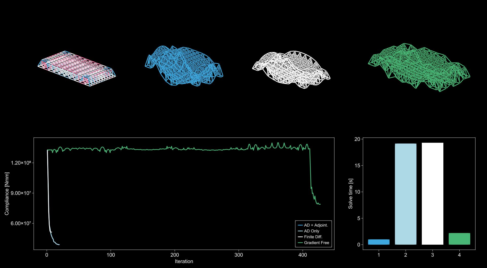

# AsapOptim

This is a very much WIP package for high-performing *general* structural optimization in the [aSAP.jl](https://github.com/keithjlee/Asap) environment. It provides the following:

- A set of data structures for controllable, extendable, and composable definitions of design variables and objective functions
- A complete set of adjoint functions (see below) for extremely high-performing automatic differentiation during gradient calculations
- A set of differentiable definitions of common structural functions to define a custom objective

Currently supports Truss structures, with frame elements following closely.

The following as an optimization problem with over 4000 variables:
- Z position of nodes at the top of the space frame
- Z position of nodes at the bottom of the space frame (different bounds)
- XY position of the support nodes (each set of 4 support nodes are rigidly tied to each other)
- Area of all elements

To minimize a compound objective of structural compliance + volume, solved in just over 10s with a relative stopping criteria of 1E-6.

# Overview

Structural optimization of large systems is difficult due to the inherent computational cost of understanding structural behaviour at each increment. For the direct stiffness FEA method, all structural behaviour (internal forces, stresses, deflected shape, etc...) is dependent on the nodal displacements under load, $u$. For a single step, this displacement vector is determined via a linear system of equations:

$$
u = K^{-1}(P-P_f)
$$

Where $K$ is the $n_{dof} \times n_{dof}$ stiffness matrix of the entire system, $P$ is the vector of nodal loads, and $P_f$ is the vector of fixed-end forces induced by loads applied directly to elements.

When considering nodal loads only, we generally assume $P$ is an independent vector, such that displacement is only a function of the global stiffness matrix:

$$
u = f(K)
$$

And the stiffness matrix is dependent on the aggregation of *elemental* stiffness matrices in the global coordinate system (GCS):

$$
K = f(K_{e1}, K_{e2}, ...) = \sum K_e
$$

And where each elemental stiffness matrix is a function of the *local* stiffness matrix and a coordinate transformation matrix:

$$
K_e = f(k_e, \Gamma) = \Gamma^Tk_e\Gamma
$$

And finally, where the stiffness matrix in LCS is a function of the element length and material properties, which for trusses:

$$
k_e = f(L, E, A) = \frac{EA}{L} \begin{bmatrix} 1 & -1\\ -1 & 1 \end{bmatrix}
$$

And the transformation matrix is dependent on the unit local x vector of the element:

$$
\Gamma = f(\vec{x}) = \begin{bmatrix} x_1 & x_2 & x_3 & 0 & 0 & 0 \\ 0 & 0 & 0 &x_1 &x_2 &x_3 \end{bmatrix}
$$

And the element length is a function of the nodal positions of the two end points. All of this is reduced to (for truss structures):

$$
u = f(\vec{X}, \vec{Y}, \vec{Z}, \vec{E}, \vec{A})
$$

Where $\vec{X}, \vec{Y}, \vec{Z}$ are the vectors of all nodal X, Y, Z positions, and $\vec{E}, \vec{A}$ are vectors of all elemental material stiffnesses and areas.

# Challenges
## Gradients
Given an arbitrary objective function based on structural behaviour, $f(u)$, to optimize the structural parameters, we must find the sensitivity of $f$ with respect to a design variable $x$. We can make use of the chain rule to determine the sequence of values we must calculate. Assume $x=x_i$, the X position of node i:

$$
\frac{df}{dx_i} = \frac{df}{du} \cdot \frac{du}{dK} \cdot \frac{dK}{dK_e} \cdot \frac{dK_e}{dk_e} \cdot \left(\frac{dke}{d\Gamma}\cdot\frac{d\Gamma}{d\vec{x}_i} \cdot \frac{d\vec{x}_i}{dx_i} + \frac{dk_e}{d_L}\cdot\frac{d_L}{dx_i} \right)
$$

Although each derivative is not necessarily difficult to derive or compute, some challenges exist:
- Most higher-order functions in this chain are functions of *multiple* primitive variables, and so the partial derivatives of all variables must be derived and stored
- Depending on whether the variable in question is *spatial* (x, y, z) or *material* (E,A), this chain can be significantly simplified and unnecessary calculations can be omitted; this must be encoded in the calculation of the derivative
- Although a single chain is more-or-less trivial, typical structural optimization problems may consist of hundreds to tens of thousands of design variables, which significantly increase the computational complexity of each optimization step.

However, the *primary* roadblock is the calculation of $du/dK$ in the derivative chain. This is derived as:

$$
\frac{du}{dK} = -u^T \otimes K^{-1}
$$

Note that as $K^{-1}$ is **not** multiplied by a vector/matrix, and *must* be explicitly calculated, such that highly optimized linear solve methods (such as Matlab/Julia's `\` operator) cannot be used. Although $K$ is a highly sparse matrix, its inverse will not be, and thus even moderately large structural systems will be infeasible to optimize in reasonable time.

## Objectives
One method of avoiding the computational complexity of gradient calculation is by fixing and understanding the objective function $f(u)$. For structural optimization, the most common objective is Compliance - a measure of the work done by the external forces on the structural system and a general proxy for "performance", as measured by stiffness and load distribution.

$$
C = u^TP = f(K)
$$

This well-defined objective function can be exploited (via the *adjoint method*) to a more efficient gradient definition:

$$
\frac{dC}{dx_i} = -u^T\frac{dK}{dx_i}u
$$

Which eliminates the inverse calculation, and requires a single linear solve $K^{-1}P$ to determine $u$ at each step. Further analytic expressions are also available for $dK/dx_i$ if $x_i$ is a *material* variable (IE Area, A), since *only* the elemental stiffness matrix is a function of area, such that:

$$
\frac{dk_e}{dA} = \frac{E}{L} \begin{bmatrix} 1 & -1\\ -1 & 1 \end{bmatrix}
$$

This is the primary exploitation for fast iterations in  Topology Optimization.

# Wishlist
Although the efficient gradients are possible if the objective function has a known exploit for reducing computation, it should *not* be a prerequisite for high-performing structural optimization. Rather, it should be possible to have high performance without restriction of the objective at hand; this is even more pressing for contemporary structural design problems that are not solely interested in proxy measures for "performance" such as matching to finite inventories, approximating target shapes, reducing unique area/length requirements, or any composition of these and other objectives. Further, we should strive to have a more fluid definition of optimization problems that are more in line with how structural designers think. Rather than:

*Optimize the nodal positions such that compliance is minimized*

we should be able to say:

*Optimize the areas of these elements, the XY positions of the columns at these bays, and the Z position of the supports to fit my design criteria*

These two challenges are summarized as:
- How can we enable *general* high performing structural optimization where the objective function is yet unknown
- How can we have more precise control of design variables while maintaining efficient gradients?

# Solution
AsapOptim addresses these challenges these challenges through **Automatic Differentiation + custom adjoints** and **composable data structures**.

## AD and adjoints
Automatic differentiation is a numerical technique of capturing *exact* gradients (up to numerical precision) of functions. It enables the training of massive ML models, but has recently seen emergence as a general useful tool in general optimization. A great overview can be found [here](https://thenumb.at/Autodiff/); AsapOptim focuses on *reverse mode* automatic differentiation using [Zygote.jl](https://github.com/FluxML/Zygote.jl).

In short, reverse mode AD starts at the final output of a chain of functions, and calculates the incremental derivative for each prior output (functions), eventually propagating these individual gradient chains to the initial input arguments. IE given an object $f((g(h(x))))$, it calculates the derivative w/r/t x in the following order:

$$
\frac{df}{dg} \cdot \frac{dg}{dh} \cdot \frac{dh}{dx}
$$

Computationally however, each gradient calculation when *backpropagating* through the computational graph accumulates the prior gradient calculation (a la chain rule). This means that the output of the second gradient chain in the step above really outputs the *pullback* at that step:

$$
\text{grad}(g) = \frac{df}{dg}\frac{dg}{dh} = \bar{f}\frac{dg}{dh}
$$

In general, modern AD packages effectively determine these incremental gradients and pullbacks for you (the *automatic* in automatic differentiation); however, in the context of structural optimization, the primary computation bottleneck remains a roadblock:

$$
\frac{du}{dK} = -u^T \otimes K^{-1}
$$

Where even through AD, the inversion of $K$ requires significant computation. However, we can exploit the fact that we do not calculate $du/dK$ explicitly, but its pullback $\bar{f} \frac{du}{dK}$, to generate a custom adjoint that bypasses the matrix inversion via:

$$
\nabla_Ku = \frac{du}{dK}\bar{f} = -u^T \otimes K^{-1}\bar{f} = -u^T \otimes \bar{u}
$$

Again eliminating the need for an explicit matrix inverse and requiring only a single linear solve for $\bar{u}$. This provides a generalized equivalent to the the adjoint solution for Compliance-based optimization. An overview of the impact of a custom adjoint, as well as comparisons to finite differencing and gradient-free methods (BOBYQA) is shown below.

AsapOptim.jl also provides explicit adjoints for:
- Conversion of elements into vector representation `getevecs`
- Length of element `getlengths`
- Normalized local x vectors `getnormalizedevecs`
- Local stiffness matrix `ktruss`
- Transformation matrix `Rtruss`
- Global  elemental stiffness matrix `getglobalks`
- Assembly of global stiffness matrix `assembleglobalK`

