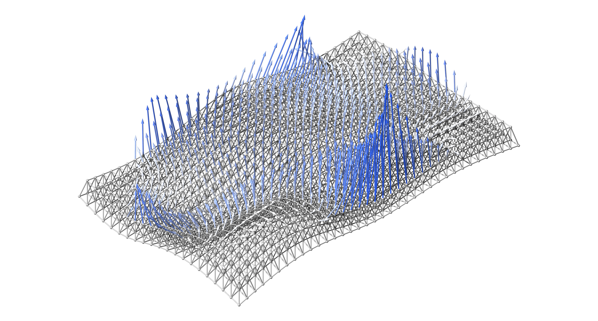
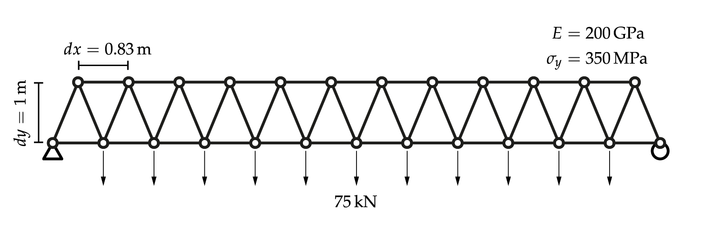
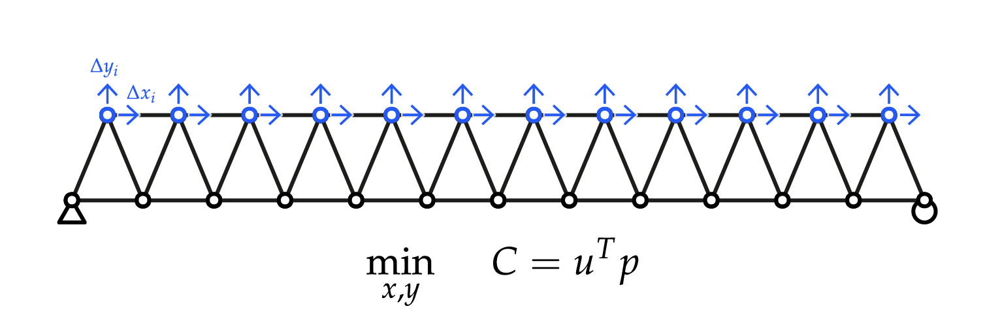
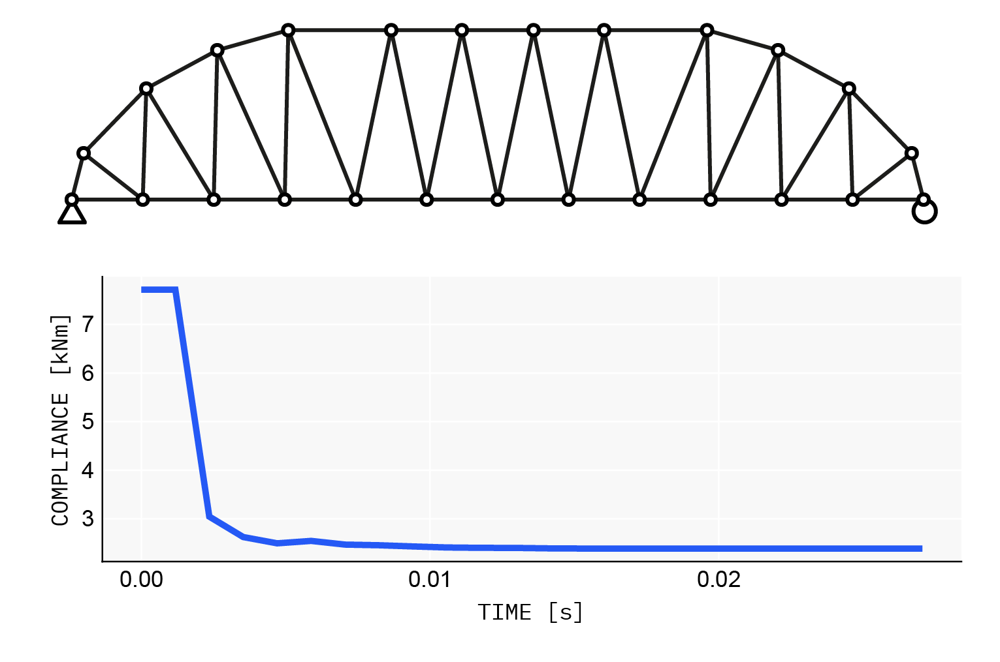
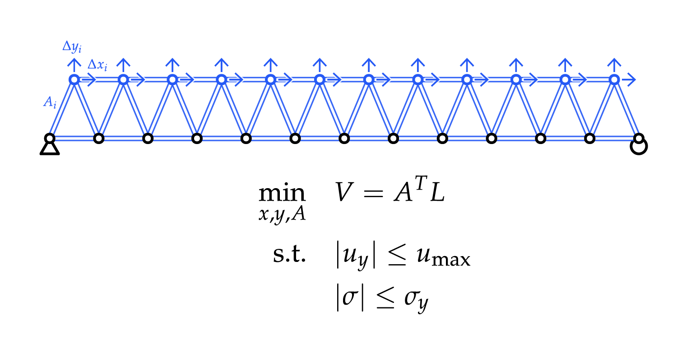
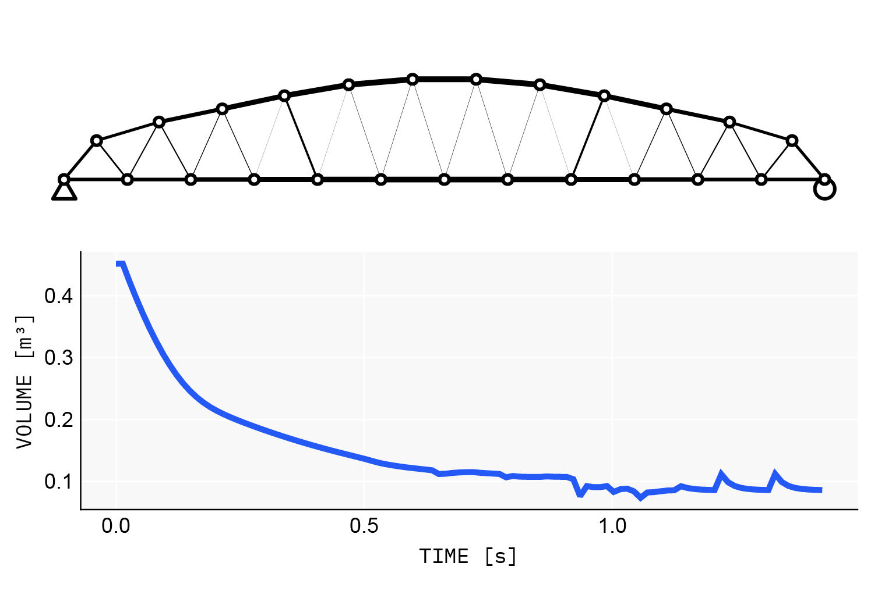

# AsapOptim.jl




High-performance, *general* structural optimization in the [Asap.jl](https://github.com/keithjlee/Asap) environment.

AsapOptim maps a **design vector** — node positions, cross-section areas, connection stiffnesses, force densities — to a differentiable structural analysis and back. You write ordinary Julia objective/constraint functions; gradients flow end-to-end through the solve via automatic differentiation, and any gradient-based optimizer (Nonconvex.jl, NLopt, Optim, your own loop) drives the design.

**v1.0** is a ground-up rewrite on Asap v1.0's differentiable core. AsapOptim no longer re-implements analysis or hand-writes adjoints — it is a thin layer (~600 lines) that compiles design variables into sparse scatter maps and evaluates designs through Asap's pure, AD-transparent solve path. One unified core handles trusses, frames, semi-rigid joints, and mixed models. See [Migrating from v0.1](#migrating-from-v01) if you used earlier versions.

## Installation

```julia-repl
pkg> add AsapOptim
```

For the examples below you will also want an AD engine and an optimizer:

```julia-repl
pkg> add Zygote Nonconvex NonconvexNLopt
```

## The workflow

Every optimization follows the same five steps:

1. **Model** — build and solve an `Asap.Model` as usual.
2. **Variables** — declare what the optimizer controls ([`SpatialVariable`](#design-variables), [`AreaVariable`](#design-variables), [`JointVariable`](#design-variables), [`CoupledVariable`](#coupling-variables-symmetry-and-grouping)).
3. **Parameters** — compile model + variables into an `OptParams` (once).
4. **Objective/constraints** — plain functions of `solve_structure(x, params)` results (or `GeometricProperties(x, params)` when no solve is needed).
5. **Optimize** — hand the function and `params.lb`/`params.ub` to your optimizer; recover the final design with `updatemodel(params, x_optimal)`.

```julia
using Asap, AsapOptim, LinearAlgebra
using Zygote                       # activates Asap's ChainRules extension

vars   = AbstractVariable[ ... ]   # step 2
params = OptParams(model, vars)    # step 3
x0     = copy(params.values)

objective(x) = compliance(solve_structure(x, params), params)   # step 4

value, gradient = Zygote.withgradient(objective, x0)            # step 5: any
                                                                # gradient-based
                                                                # optimizer from here
```

## Quick start: geometry optimization

The runnable files for everything below are in `examples/`. Consider this truss:



Built with Asap:

```julia
using Asap

steel = Material(200e6, 80.0, 0.3)        # E [kN/m²], ρ, ν
section = Section(steel, 0.01)            # axial-only, A = 0.01 m²

L = 10.0    # span [m]
nx = 12     # bays
dy = 1.0    # depth [m]
load = 75.0 # per-node load [kN]
dx = L / nx

bottom_nodes = [Node([x, 0.0, 0.0], :free, :bottom) for x in range(0, L, nx + 1)]
fixnode!(first(bottom_nodes), :pinned)
fixnode!(last(bottom_nodes), :xfree)

top_nodes = [Node([dx / 2 + dx * (i - 1), dy, 0.0], :free, :top) for i in 1:nx]

bottom_elements = [TrussElement(bottom_nodes[i], bottom_nodes[i+1], section, :bottom) for i in 1:nx]
top_elements = [TrussElement(top_nodes[i], top_nodes[i+1], section, :top) for i in 1:nx-1]
web_elements = [
    [TrussElement(nb, nt, section, :web) for (nb, nt) in zip(bottom_nodes[1:end-1], top_nodes)];
    [TrussElement(nt, nb, section, :web) for (nt, nb) in zip(top_nodes, bottom_nodes[2:end])]
]

nodes = [bottom_nodes; top_nodes]
elements = AbstractElement{Float64}[bottom_elements; top_elements; web_elements]
loads = AbstractLoad{Float64}[NodeForce(node, [0.0, -load, 0.0]) for node in nodes[:bottom]]

model = Model(nodes, elements, loads)
planarize!(model)
solve!(model)
```



Let's find the minimum-compliance (maximum-stiffness) geometry by letting every top-chord node move in x and y:

```julia
using AsapOptim, LinearAlgebra
using Zygote

xmin, xmax = (-1, 1) .* dx ./ 2 .* 0.9
ymin, ymax = -0.9dy, dy

vars = AbstractVariable[
    [SpatialVariable(node, 0.0, xmin, xmax, :X) for node in model.nodes[:top]];
    [SpatialVariable(node, 0.0, ymin, ymax, :Y) for node in model.nodes[:top]]
]

params = OptParams(model, vars)
x0 = copy(params.values)      # the optimizer's starting point
```

The objective is one line — `solve_structure` evaluates a design, `compliance` reduces it to the scalar `Fᵀu`:

```julia
OBJ = x -> compliance(solve_structure(x, params), params)

Zygote.withgradient(OBJ, x0)  # value and exact gradient, no extra setup
```

Optimize with anything gradient-based — here L-BFGS via Nonconvex.jl:

```julia
using Nonconvex, NonconvexNLopt

optmodel = Nonconvex.Model(OBJ)
addvar!(optmodel, params.lb, params.ub)

res = optimize(optmodel, NLoptAlg(:LD_LBFGS), x0,
    options = NLoptOptions(maxeval = 500, maxtime = 60))

model2 = updatemodel(params, res.minimizer)   # a solved Asap.Model of the optimum
```



## Constrained optimization: geometry + sizing



Add member areas as variables and minimize material volume subject to displacement and stress limits — without the constraints, the trivial optimum is a flat truss of zero area; with them, depth trades against member force:

```julia
vars = AbstractVariable[
    [SpatialVariable(node, 0.0, xmin, xmax, :X) for node in model.nodes[:top]];
    [SpatialVariable(node, 0.0, ymin, ymax, :Y) for node in model.nodes[:top]];
    [AreaVariable(element, element.section.A, 0.01 * element.section.A, 5 * element.section.A)
     for element in model.elements]
]

params = OptParams(model, vars)
x0 = copy(params.values)

# objective: material volume — geometry only, no solve needed
function obj(x, p)
    geo = GeometricProperties(x, p)
    dot(geo.L, geo.A)
end
OBJ = x -> obj(x, params)

# constraints: g(x) .<= 0 feasible (Nonconvex.jl convention), each row
# normalized by its limit — mixed-scale constraint rows stall MMA
# NOTE the DOF layout: 6 DOFs per node — vertical displacements are U[2:6:end]
function cstr(x, p, dmax, smax)
    res = solve_structure(x, p)
    return [
        abs.(res.U[2:6:end]) ./ dmax .- 1.0;
        abs.(axial_stress(res, p)) ./ smax .- 1.0
    ]
end
CSTR = x -> cstr(x, params, dmax, fy)

optmodel = Nonconvex.Model(OBJ)
addvar!(optmodel, params.lb, params.ub)
add_ineq_constraint!(optmodel, CSTR)

res = optimize(optmodel, NLoptAlg(:LD_MMA), x0,
    options = NLoptOptions(maxeval = 500, maxtime = 60))

model2 = updatemodel(params, res.minimizer)
```



## Design variables

All variables share the pattern `Variable(target, start_value, lower_bound, upper_bound, ...)`. Mind the two semantics:

| Variable | Controls | Semantics |
|---|---|---|
| `SpatialVariable(node, value, lb, ub, axis)` | node position along `:X`/`:Y`/`:Z` | **additive** — the design entry is an *offset* from the modeled position (start at `0.0` to begin from the current geometry) |
| `AreaVariable(element, value, lb, ub)` | cross-section area | **absolute** — the design entry *replaces* the section's area; `Ix`, `Iy`, `J`, and the material are kept |
| `JointVariable(element, position, value, lb, ub)` | rotational end-spring stiffness `ky = kz` at `:start`, `:end`, or `:both` of a `FrameElement` | **absolute** [force·length/rad] — semi-rigid connection design (see `examples/joint-stiffness.jl`) |
| `QVariable(element, value, lb, ub)` | FDM force density of an `FDMelement` | **absolute** — for the [network path](#force-density-network-optimization) |

Notes:

- `AreaVariable` requires a geometric `Section`; a `RigiditySection` has no area to vary — parameterize its rigidities directly instead.
- `JointVariable` errors (at `OptParams` time) if the element also carries an element load, because the load's fixed-end forces would not track the changing stiffness. Apply such loads as `NodeForce`s or split the member.

### Coupling variables: symmetry and grouping

`CoupledVariable(target, parent, factor = 1.0)` makes `target` share `parent`'s design-vector entry, scaled by `factor` — equality constraints expressed for free, shrinking the design space instead of adding constraint rows:

```julia
# mirror-symmetric geometry: right node's x-offset is the negative of the left's
x_left = SpatialVariable(left_node, 0.0, -1.0, 1.0, :X)
x_right = CoupledVariable(right_node, x_left, -1.0)

# member groups: all web elements share one area
a_web = AreaVariable(web_elements[1], 0.01, 1e-4, 0.05)
groups = [CoupledVariable(el, a_web) for el in web_elements[2:end]]

# joint pairs: couple another element's end to a JointVariable
# (target may be an element, or an (element, position) tuple)
j = JointVariable(beam1, :start, 1e8, 1e5, 1e12)
mirror = CoupledVariable((beam2, :end), j)
```

Always couple to the *independent* parent — chains of couplings are rejected.

Variable types **mix freely in one problem**: spatial + area + joint-stiffness variables (plus any couplings) can drive a single `OptParams`, on models mixing frame and truss elements — every combination is gradient-tested against finite differences in the suite. Not yet available: parameterizing a section's flexural properties (`Ix`/`Iy`/`J`) — the planned `SectionVariable`.

## Evaluating designs

### `solve_structure(x, params) -> OptResults`

The full differentiable analysis: scatter positions/areas/joint stiffnesses, run Asap's pure solve, package the results. `solve_truss` and `solve_frame` are aliases — the v1.0 core is unified, so one function serves both (and mixed models).

`OptResults` fields, all plain data — any scalar function of them is differentiable back to `x`:

- `U` — global displacement vector, **6 DOFs per node** (`ux, uy, uz, θx, θy, θz`): node `i`'s translations are `U[6(i-1) .+ (1:3)]`; all y-displacements are `U[2:6:end]`, all z-displacements `U[3:6:end]`
- `X` — evaluated node positions (3 × n_nodes)
- `A`, `L` — per-element areas and lengths
- `sections`, `EA` — evaluated sections and axial rigidities

Built-in reductions of an `OptResults`:

- `compliance(res, params)` — external work `Fᵀu`, the canonical smooth stiffness objective
- `axial_force(res, params)` — per-element axial force, tension-positive
- `axial_stress(res, params)` — axial force over evaluated area

### `GeometricProperties(x, params)`

Geometry-only evaluation — positions `X`, lengths `L`, areas `A` — with **no structural solve**. Use it for objectives like material volume (`dot(geo.A, geo.L)`) where paying for a solve (and its gradient) would be waste.

### `updatemodel(params, x) -> Model`

Materializes a design back into the reference `Asap.Model`: writes positions, sections, and joint stiffnesses, re-solves, and returns the ordinary mutable model — ready for post-processing, force recovery, visualization, or export.

## Force-density network optimization

The same variable → params → solve pattern works on `Asap.Network` (FDM form-finding). `solve_network` is differentiable in the force densities end-to-end:

```julia
qv = QVariable(network.elements[1], 1.0, 0.1, 10.0)
vars = AbstractVariable[qv; [CoupledVariable(el, qv) for el in network.elements[2:5]]]

nparams = NetworkOptParams(network, vars)

function obj(x)
    res = solve_network(x, nparams)          # NetworkResults: X, Y, Z, Q, L
    sum(abs2, member_forces(res))            # forces are Q .* L, tension-positive
end

Zygote.gradient(obj, copy(nparams.values))
```

## AD backends: reverse for objectives, forward for constraints

Loading **Zygote** (or anything ChainRulesCore-aware) is all the setup reverse-mode AD needs — Asap's rule extension activates automatically; there are no custom rules in this package. **ForwardDiff**, **Mooncake**, and **Enzyme** (both modes) also work out of the box.

The rule of thumb, from extensive benchmarking ([`docs/AD_BACKENDS.md`](docs/AD_BACKENDS.md)):

- **Scalar objectives** (compliance, volume): reverse mode — Zygote or Enzyme. Cost ≈ one extra adjoint solve, independent of the number of design variables.
- **Constraint Jacobians** (per-element stresses, nodal displacements): **forward mode — ForwardDiff**. A forward Jacobian costs the same as a forward gradient (extra outputs are free), so it beats reverse by two orders of magnitude on constraint blocks: the 512×512 stress Jacobian of our benchmark spaceframe takes **43 ms with ForwardDiff vs 7.6 s with Zygote**.

This holds whenever you have at least as many constraint rows as design variables — which describes most sized/shaped structural problems, since stresses are checked in every element.

### Choosing the linear solver

`OptParams` takes a `solver` keyword that applies to every solve through the params — values, reverse-mode adjoints, and forward-mode tangents alike:

```julia
params = OptParams(model, vars)                              # built-in CHOLMOD
params = OptParams(model, vars; solver = KLUFactorization()) # any LinearSolve.jl algorithm
params = OptParams(model, vars; solver = Asap.CachedSolver())# factorization sharing (below)
```

### Sharing work between the objective and the constraints

At each optimizer iterate, the objective gradient, the constraint Jacobian, and every ForwardDiff chunk assemble and factorize the *same* stiffness matrix. `Asap.CachedSolver()` makes them share one factorization: it keys on the stiffness values, reuses the factorization when they're unchanged, and refactorizes numerically (reusing the symbolic analysis) when they move. No changes to your objective/constraint code — it's purely a `params` setting. One `CachedSolver` per `OptParams`; standard AD drivers and optimizer loops satisfy its (documented) atomicity contract automatically.

The complete pattern — mixed AD + shared factorization + NLopt driven directly — is `examples/truss-optimization3-nlopt.jl`. Distilled:

```julia
using NLopt, Zygote, ForwardDiff, DifferentiationInterface

params = OptParams(model, vars; solver = Asap.CachedSolver())
x0 = copy(params.values)

volume(x) = begin geo = GeometricProperties(x, params); dot(geo.L, geo.A) end
constraints(x) = begin                      # g(x) .<= 0, rows normalized by limits
    res = solve_structure(x, params)
    [abs.(res.U[2:6:end]) ./ dmax .- 1.0; abs.(axial_stress(res, params)) ./ fy .- 1.0]
end

# reverse mode for the scalar objective
function nlopt_objective(x, grad)
    v, g = Zygote.withgradient(volume, x)
    length(grad) > 0 && (grad .= g[1])
    return v
end

# prepared FORWARD mode for the constraint Jacobian
backend = AutoForwardDiff()
prep = prepare_jacobian(constraints, backend, x0)
function nlopt_constraints!(result, x, grad)   # NLopt wants grad = J' (n × m)
    v, J = value_and_jacobian(constraints, prep, backend, x)
    result .= v
    length(grad) > 0 && (grad .= J')
end

opt = Opt(:LD_MMA, length(x0))
NLopt.lower_bounds!(opt, params.lb); NLopt.upper_bounds!(opt, params.ub)
NLopt.min_objective!(opt, nlopt_objective)
NLopt.inequality_constraint!(opt, nlopt_constraints!, fill(1e-8, length(constraints(x0))))
minf, minx, ret = optimize(opt, x0)
```

On the example-2 problem this runs 500 MMA iterations in ~7 s where the all-Zygote Nonconvex formulation needs ~60 s. If you prefer staying in Nonconvex.jl, wrap the same per-function derivatives with `Nonconvex.CustomGradFunction(f, g)` instead.

### Even faster constraint Jacobians: implicit differentiation

For the common constraint quantities, `solution_tangents(x, params)` computes the exact solution tangents `∂U/∂x` by the implicit-function theorem — one factorization, one multi-RHS back-substitution — about **10× faster than the prepared ForwardDiff Jacobian** (3.9 ms vs 43 ms on a 512-element / 512-variable benchmark) with ~20× less allocation:

```julia
t = solution_tangents(x, params)        # res + ∂U/∂x, exact
J = [
    -t.dU[3:6:end, :];                  # vertical-displacement rows
    axial_stress_jacobian(t, params)    # stress rows
]
```

It works for any mix of spatial/area/joint variables and couplings (verified to machine precision against ForwardDiff and Zygote), and respects `params.solver`. It is a plain-`Float64` evaluation path for optimizer callbacks — not itself differentiable.

Enzyme notes: reverse mode works as before (`examples/ad_backends/`); forward mode is verified correct on Julia 1.11 with the default solver (native rule in Asap) and is a useful independent check, but ForwardDiff is faster for Jacobians. See `docs/AD_BACKENDS.md` for the current per-version status.

## Examples

| File | What it shows |
|---|---|
| `examples/truss-optimization1.jl` | geometry optimization, compliance objective (the quick start) |
| `examples/truss-optimization2.jl` | constrained minimum volume: geometry + sizing, MMA |
| `examples/truss-optimization3-nlopt.jl` | the recommended pattern: NLopt driven directly, reverse-mode objective + forward-mode constraint Jacobian + `CachedSolver` (~9× faster per run than the all-Zygote formulation) |
| `examples/vierendeel-geometry.jl` | FRAME optimization — Vierendeel truss profile, volume-scaled compliance, hand-rolled projected gradient descent |
| `examples/joint-stiffness.jl` | `JointVariable`: cheapest distribution of semi-rigid connection stiffness meeting a drift limit |
| `examples/ad_backends/` | the same problem differentiated with Zygote, Mooncake, and Enzyme |

## Migrating from v0.1

- `TrussOptParams` and `FrameOptParams` still work — they are now aliases of the unified `OptParams`, and `solve_truss`/`solve_frame` alias `solve_structure`.
- `res.U` is now the **full 6-DOF-per-node** vector for every model (v0.1's truss path was 3-DOF): vertical displacements are `U[2:6:end]`, not `U[2:3:end]`.
- Results carry positions as a 3 × n matrix `res.X` instead of separate `X`/`Y`/`Z` vectors.
- The static load vector for compliance-style objectives is `params.F` (or just use `compliance(res, params)`).
- Custom rrules, the functional re-assembly path, and the truss/frame code split are gone — differentiability comes from Asap's core. The old implementation is preserved (unloaded) in `legacy_v0/` for reference.
- Not yet ported: full section parameterization (`SectionVariable`); `RigiditySection`-based parameterization is the intended v1.0 idiom.
